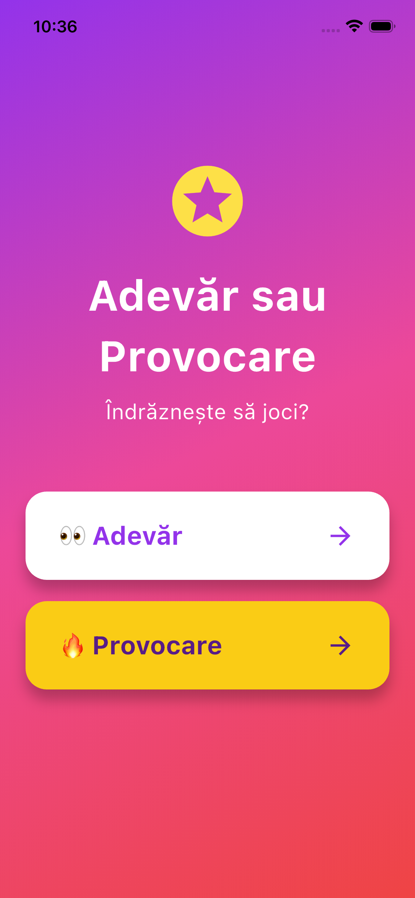
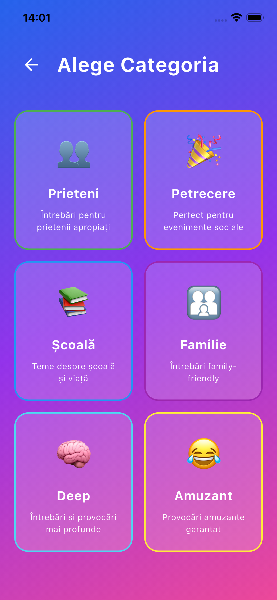
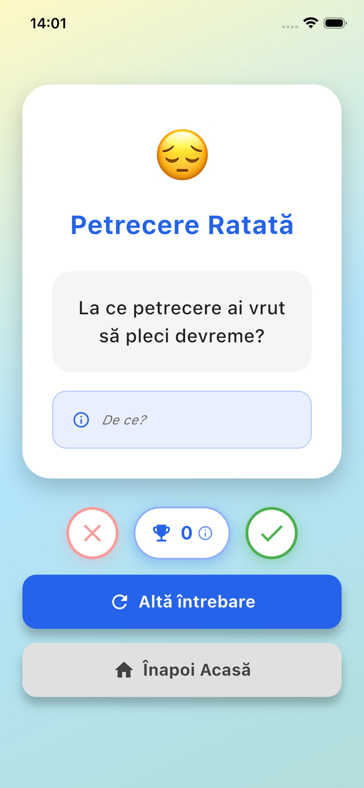
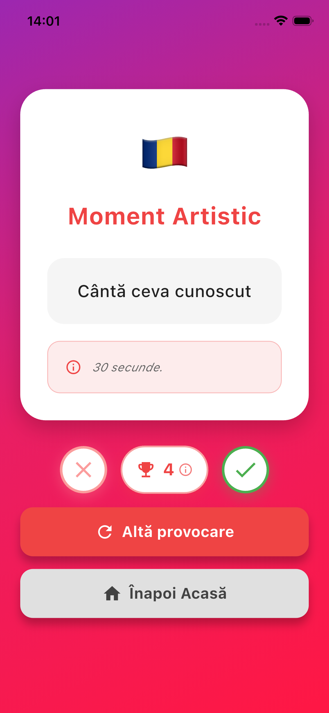
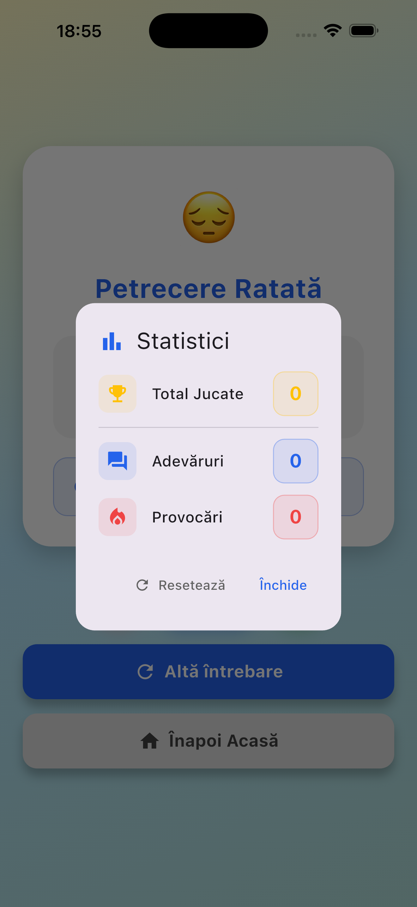
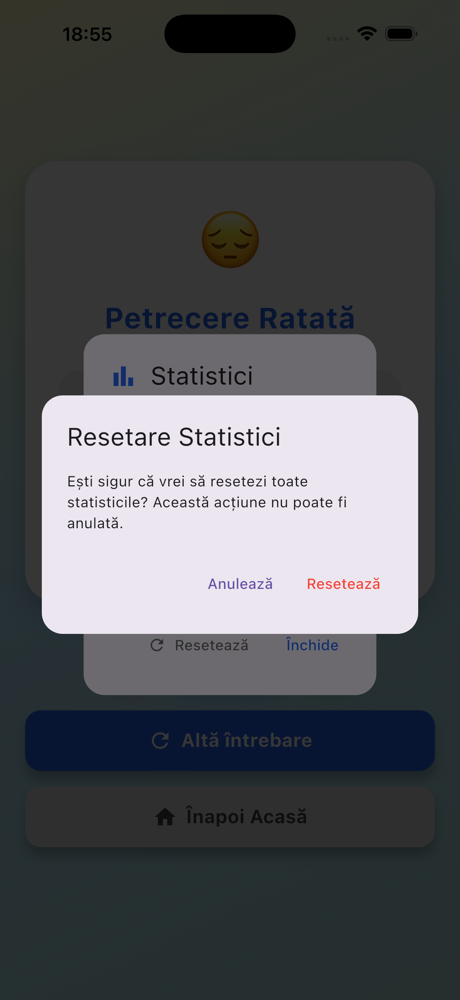

# Adevar sau Provocare

O aplicație Flutter interactivă care aduce jocul clasic "Adevăr sau Provocare" în era digitală!
## ✨ Despre Proiect

Aplicație Flutter creată ca proiect individual pentru cursul de Tehnologii pentru Dispozitive Mobile. Demonstrează concepte avansate de dezvoltare Flutter: navigare complexă între ecrane, state management, widget-uri custom reutilizabile, animații fluide și persistență de date.

## 📱 Screenshots

  
  
  
  
  
  

🎯 Funcționalități

• 6 Categorii Diverse  
  Prieteni · Petrecere · Școală · Familie · Picant · Amuzant  

• Provocări Detaliate  
  Titlu funny · emoji unic · conținut clar · descriere explicativă  

• Animații de Gradient  
  10 seturi de culori · 5 pentru Adevăr · 5 pentru Provocare · tranziții smooth  

• Sistem de Tracking  
  Butoane interactive ✓ / ✗ pentru confirmarea provocărilor  

• Statistici Persistente  
  SharedPreferences salvează progresul utilizatorului  

• Design Modern  
  Culori pastelate pentru Adevăr · nuanțe aprinse pentru Provocare  

• Navigare Intuitivă  
  3 ecrane principale · tranziții naturale · back navigation  

• Cod Curat  
  Arhitectură modulară · structură clară · ușor de extins  

## ✨ Design Features

• Gradient-uri Dinamice  
  Fiecare provocare are gradient animat · tranziție 800ms  

• Paletă Pastelată  
  Roz pal · lavandă · mentă · piersică pentru Adevăr  

• Paletă Aprinsă  
  Roșu intens · portocaliu · magenta pentru Provocare  

• Butoane Circulare  
  Action buttons cu shadow · glow · feedback vizual  

• Cards Interactive  
  Header (emoji + titlu) · conținut · descriere separate clar  

## 📊 Sistem de Statistici

• Counter în Timp Real  
  Badge 🏆 afișează totalul provocărilor completate  

• Tracking Separat  
  Evidență distinctă pentru Adevăruri vs Provocări  

• Dialog Detaliat  
  Breakdown complet · iconițe · coduri de culoare  

• Reset cu Confirmare  
  Dialog de siguranță pentru resetarea statisticilor  

• Persistență Locală  
  Datele rămân salvate după închiderea aplicației  

## Principii Arhitecturale Aplicate

✅ Separarea Responsabilităților  
   Fiecare modul are un singur scop clar  

✅ Widget-uri ca Clase  
   NU funcții · performanță optimă în Flutter  

✅ Centralizare Constante  
   Zero hardcoding pentru texte și culori  

✅ Type Safety  
   Enum-uri și clase tipizate · Category · Challenge · ChallengeType  

✅ Clean Code  
   Build methods sub 100 linii · widget-uri extrase  

✅ State Management  
   StatefulWidget + setState() pentru simplitate  

✅ Persistență  
   SharedPreferences pentru salvare locală  

✅ Callback Pattern  
   Comunicare între widget-uri prin callbacks  

🛠️ Tehnologii

• Flutter & Dart  
• Material Design  
• State Management cu StatefulWidget  

